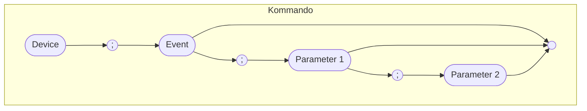

# Kommunikation zwischen Hardware und X-Plane auf dem PC {#Kommunikation}

## Übertragung der Daten zwischen PC und Arduino

### Allgemeiner Aufbau

Die Kommunikation erfolgt durch wechselseitiges Senden/Empfangen von Kommandostrings. Ein Kommandostring besteht immer aus 5 verschiedenen Teilen, die im Ganzen als zusammengesetzter String verschickt werden. Die einzelnen Teile sind jeweils durch ein Blank getrennt. Am Ende steht immer ein \<CR> ("\\r") und/oder ein \<LF> ("\\n").

1. Device: Gerät, das angesprochen werden soll, oder von dem Daten kommen,
1. Action: Aktion, die vom Device ausgeführt wurde, oder ausgeführt werden soll,
1. Para 1: 1. Parameter zur Aktion, d.h. die Nutzdaten (optional),
1. Para 2: 2. Parameter zur Aktion, d.h. die Nutzdaten (optional).

Kommandoteil | Datentyp @todo: noch anpassen
-------------|--------------------------
Device       | char / uint8_t
Event        | char*
Para 1       | @todo ergänzen
Para 2       | @todo ergänzen

**Beispiele**

Kommandostring | Bedeutung
:--------------|------------------------
`X;X;7000`     | Nachricht von X-Plane an Arduino: Im Transponderfeld den Wert "7000" anzeigen.
`X;C; 20.3`    | Nachricht von X-Plane an Arduino: Im O.A.T.-Feld den Wert " 20.3" anzeigen. Der @ steht für ein Blank. Dieser Sonderfall ist nötig, damit das parsen einfacher wird (Blanks trennen die einzelnen Bestandteile des Kommandostrings)
`S;ON;2;3`     | Nachricht vom Transponder: Der **S**chalter an der Position row=**2** und col=**3** (in der Schaltermatrix) wurd eingeschaltet (**ON**).
| |

Für die Entwicklungs- und Testphase werde Buchstaben statt roher Bytes verwendet, da diese im Terminal direkt gelesen werden können.

## Transponder KT 76C und Uhr Davtron M803

Siehe auch @ref commands.hpp für die aktuelle Version der Codes.
@todo noch weiter ergänzen und updaten!!

### Devices

Ein Device definiert das "Gerät", von dem die nachfolgende Action ausgeführt werden soll (auf dem Arduino) bzw. von dem die Action stammt (vom Arduino für den PC).

| Device | Const              | Beschreibung                                    |
| ------ | ------------------ | ----------------------------------------------- |
| X      | DEVICE_XPDR = "X " | Action betrifft Transponder KT76C               |
| M      | DEVICE_M803 = "M"  | Action betrifft Uhr Davtron M803                |
|        |                    |                                                 |
| D      | DEVICE_DATA = "D " | Daten, z.B. die am Arduino eingestellte Uhrzeit |

### Definierte Events

 Event  |Const               | Beschreibung                                               | Parameter&nbsp;1 Typ | Parameter&nbsp;2 Typ | Parameter-Beschreibung
--------|--------------------|------------------------------------------------------------|--------------------|---|-----------------------
 ON     | SWITCH_ON = "ON"   | (Schalter) wurde eingeschaltet     | Row uint8_t | Col uint8_t | Position (row, col) in der Schaltermatrix
 LON    | SWITCH_LON = "LON" | (Schalter) ist lange eingeschaltet | Row uint8_t | Col uint8_t | Position (row, col) in der Schaltermatrix
 OFF    | SWITCH_OFF = "OFF" | (Schalter) ist ausgeschaltet       | Row uint8_t | Col uint8_t | Position (row, col) in der Schaltermatrix
 X      | XPDR_CODE = "X"    | XPDR-Code anzeigen                         | Transponder-Code String        | - | 4-stellig
 L      | XPDR_FL = "F" .    | Flightlevel für Transponder                                | Flightlevel String | - | 3-stellig
 LT     | M803_LT = "LT"     | Aktuelle Uhrzeit (Local)                                   | Uhrzeit String | - | Uhrzeit HHMMSS
 UT     | M803_UT = "UT"     | Aktuelle Uhrzeit (UTC)                                     | Uhrzeit String | - | Uhrzeit HHMMSS
 ET     | M803_ET = "E"      | Elapsed Time                                               | ?                  |   | Vergangene Zeit HHMMSS
 FT     | M803_FT = "FT"     | Flight Time                                                | ?                  |   | Flight Time in HHMMSS
 V      | M803_VOLTS = "V"   | Spannung in Volt - eigentlich EMF, aber hat der Flusi nicht? | ?                |   | Spannung in Volt
 Q      | M803_QNH = "Q"     | Aktuelles QNH des X-Plane-Wetters                          | ?                  |   | 4-stellig
 A      | M803_ALT = "A"     | Aktuelles Altimeter-Setting in inHg                        | ?                  |   |
 C      | M803_OATC = "C"    | OAT in °C                                                  | ?                  |   | OAT in Celsius
 F      | M803_OATF = "F"    | OAT in Fahrenheit                                          | ?                  |   | OAT in Fahrenheit

## Steuerkommandos für den Arduino

| const-Name      | Event  | Beschreibung                                               | Parameter-Typ | Parameter-Beschreibung |
| --------------- | ------ | ---------------------------------------------------------- | ------------- | ---------------------- |
| ACK             | 0xFFFF | Acknowledge - Angeforderte Daten für Parameter Code folgen |               |                        |
| RESET_ARDUINO   | 0xFF01 | Arduino neu booten                                         | -             |                        |
| RESEND_SWITCHES | 0xFF02 | Den Status aller Schalter senden                           | -             |                        |

Für die Entwicklungs- und Testphase werde Buchstaben statt roher Bytes verwendet, da diese im Terminal direkt gelesen werden können.

### Events und X-Plane-Datarefs

Action            | X-Plane-Dataref                                                                                 | X-Plane-Typ | r/w
------------------|-------------------------------------------------------------------------------------------------|-------------|----
M803_LT           | sim/cockpit2/clock_timer/local_time_hours, .../local_time_minutes, .../local_time_seconds       | int         |  r
M803_UT           | sim/cockpit2/clock_timer/zulu_time_hours, .../zulu_time_minutes, .../zulu_time_seconds          | int         |  r
M803_ET           | sim/cockpit2/clock_timer/elapsed_time_hours, .../elapsed_time_minutes, .../elapsed_time_seconds | int         |  r
M803_FT           | sim/cockpit2/clock_timer/timer_elapsed_time_sec (=total time elapsed in seconds)                | float       | r/w
M803_VOLTS        | sim/cockpit2/electrical/battery_voltage_actual_volts                                            | float[8]    |  r
M803_QNH          | = M803_ALT * 33.8637526
M803_ALT          | sim/weather/barometer_current_inhg                                                              | float       | r/w
M803_OATC         | sim/cockpit2/temperature/outside_air_temp_degc, .../outside_air_temp_is_metric (int 1=C, 0=F)   | float       |  r
M803_OATF         | sim/cockpit2/temperature/outside_air_temp_degf, .../outside_air_temp_is_metric (int 1=C, 0=F)   | float       |  r

Vom Arduino zum PC gesendete Actions
------------------------------------------------------------------

@todo noch weiter ergänzen und updaten!!

const-Name       | Event  | Beschreibung                          | Parameter-Typ            | Parameter-Beschreibung
-----------------|--------|---------------------------------------|--------------------------|-----------------------
SWITCH_ON        | 0x1101 | Schalter/Taster eingeschaltet         | uint8_t row, uint8_t col | Row und Col in der Schaltermatrix
SWITCH_LON       | 0x1102 | Schalter/Taster lange eingeschaltet   | uint8_t row, uint8_t col | Row und Col in der Schaltermatrix
SWITCH_OFF       | 0x1103 | Schalter/Taster ausgeschaltet         | uint8_t row, uint8_t col | Row und Col in der Schaltermatrix
REQUEST_DATA     | 0x1F01 | Daten vom PC anfordern                | uint16_t Arduino-Action  | -
